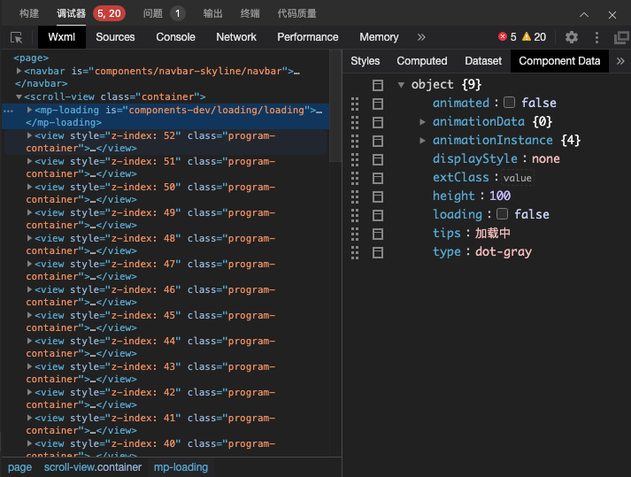

> 来源：微信开放文档（官方页面）
> 原始链接：[https://developers.weixin.qq.com/miniprogram/dev/framework/component-framework/data-control.html](https://developers.weixin.qq.com/miniprogram/dev/framework/component-framework/data-control.html)
> 抓取日期：2026-09-05
> 原始 HTML：`raw-html/component-framework/data-control.html`

# 数据控制概述

操作组件数据 `data` 时，有一些高级手段控制 `data` 自身的维护方式、提升性能：

- 如果需要监听数据的变化，可以使用 [数据监听器](../observer) ；
- 除了 `setData`，还有其他一些手段来更高效地更新数据，请参考 [高级数据更新方法](data-updates) 和 [数据更新策略](data-update-strategy) ；
- 数据字段在组件之间会深拷贝，要改变这一行为，请参考 [数据字段拷贝控制](data-deep-copy) 。

`data` 在 WXML 上的应用方式也可以微调，以提升 WXML 模版更新性能：

- 选用合适的 [组件初始化策略](init-strategy) 可以减少一些不必要的模板更新；
- 使用 [纯数据字段](../pure-data) 可以禁止部分 `data` 数据字段用于 WXML 模板。

此外，在开发者工具的 WXML 面板中可以查看自定义组件实例的数据：先选中需要查看的自定义组件，然后切换到 `Component Data` 即可实时查看当前自定义组件的数据。

