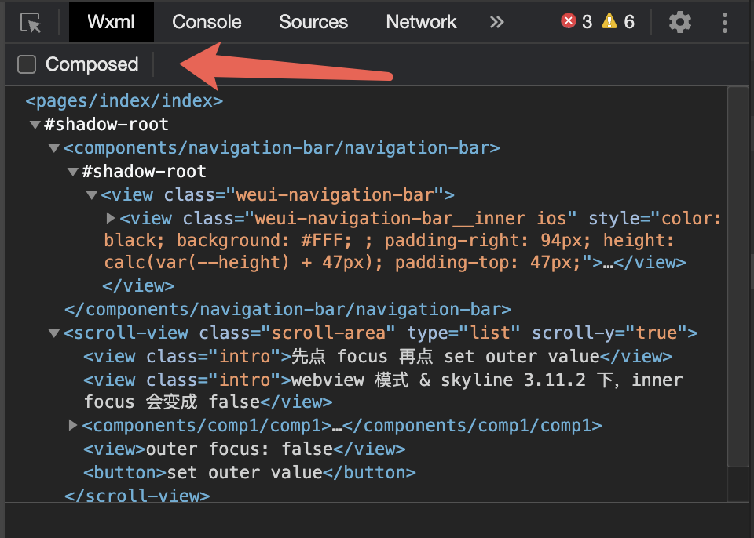

> 来源：微信开放文档（官方页面）
> 原始链接：[https://developers.weixin.qq.com/miniprogram/dev/framework/custom-component/component-system.html](https://developers.weixin.qq.com/miniprogram/dev/framework/custom-component/component-system.html)
> 抓取日期：2026-09-05
> 原始 HTML：`raw-html/custom-component/component-system.html`

# 组件系统

小程序采用了类似 Shadow DOM 模型来实现组件的封装。每个组件都拥有自己的 Shadow 树，从而将组件的样式和结构与外部环境隔离。这种隔离机制使得组件更加模块化。

## Shadow 树

在这个模型中，有两种树的概念：Shadow 树和 Composed 树。

Shadow 树指的是每个组件的内部 WXML 节点树结构。例如，`comp.wxml` 形如：

```
<!-- 这是自定义组件 comp 的 WXML 结构 -->
<view class="inner"></view>
<slot></slot>
```

它里面的 `<view class="inner">` 和 `<slot>` 就构成了它的 Shadow 树。

对于引用它的页面 `page.wxml` 形如：

```
<!-- 这是使用 comp 的 WXML 结构 -->
<comp>
  <view class="outer"></view>
</comp>
```

[在开发者工具中预览效果](https://developers.weixin.qq.com/s/vozCVwmH81bI)

这个页面本身也有自己的 Shadow 树，由 `<comp>` 和 `<view class="outer">` 构成。

## Composed 树

组件框架会把页面中所有 Shadow 树组合起来，形成 Composed 树。

以上面这两个 Shadow 树为例，组件框架会首先把每个组件的 Shadow 树放置到对应的组件节点位置上。此时，每个 Shadow 树的树根称为 **shadow-root** 节点，它对应的组件节点本身称为 **host** 节点。

```
<comp> <!-- comp 组件的 host 节点 -->
  #shadow-root <!-- comp 组件的 Shadow 树根，即 shadow-root -->
    <view class="inner"></view>
    <slot></slot>
  <view class="outer"></view>
</comp>
```

然后，组件框架会把 slot 对应的内容放置在 slot 节点的位置上。

```
<comp>
  #shadow-root
    <view class="inner"></view>
    #slot <!-- comp 组件的 slot 节点 -->
      <view class="outer"></view> <!-- page 组件提供给 comp 组件的 slot 内容 -->
</comp>
```

最后，组件框架会移除所有 shadow-root 和 slot 节点，最终形成 Composed 树。

```
<comp>
  <view class="inner"></view>
  <view class="outer"></view>
</comp>
```

[在开发者工具中预览效果](https://developers.weixin.qq.com/s/PNzORwmf81bI)

## 在开发者工具中查看树结构

在开发者工具的 WXML 面板中，可以选择查看 Shadow 树还是 Composed 树。Shadow 树更接近代码中的 WXML 结构，而 Composed 树则更接近实际渲染结果。



## Shadow 树的隔离特性

通过 Shadow 树提供的封装能力，组件间的样式和逻辑得到了更明确的隔离，从而避免了外部的干扰。Shadow 树提供了以下几种隔离特性。

### 样式隔离

不同组件的 WXSS 样式（以及全局的 `app.wxss`）是相互隔离的，彼此间无法互相覆盖或影响，也无法直接使用全局的 `class`。

可以通过 [组件样式隔离](../component-framework/style#组件样式隔离) 或 [外部样式类](../component-framework/external-classes) 等方式，灵活地控制样式的隔离。

### 事件隔离

通过 [triggerEvent](../component-framework/event-system#触发事件) 触发的事件会被限制在 Shadow 树内进行捕获和冒泡，外部组件无法直接监听这些事件。

可以通过设置 `composed` 参数，改变事件的冒泡和捕获行为，从而允许事件跨越 Shadow 树。

### SelectQuery 隔离

使用 [获取界面上的节点信息](../view/selector) 相关接口时，只能获取当前 Shadow 树内的节点，无法访问其他组件的 Shadow 树或外部元素。

