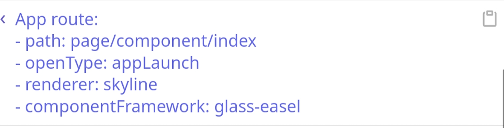

> 来源：微信开放文档（官方页面）
> 原始链接：[https://developers.weixin.qq.com/miniprogram/dev/framework/custom-component/glass-easel/migration.html](https://developers.weixin.qq.com/miniprogram/dev/framework/custom-component/glass-easel/migration.html)
> 抓取日期：2026-09-05
> 原始 HTML：`raw-html/custom-component/glass-easel/migration.html`

# glass-easel 适配指引

将现有的运行在 exparser 组件框架上的小程序迁移到 glass-easel 时需要少量的适配。

> 对于 WebView 渲染引擎，小程序基础库版本 [3.8.12](../../compatibility) 开始支持 glass-easel 组件框架。

> 若迁移到 Skyline 渲染引擎，由于 Skyline 只支持 glass-easel 组件框架，因此必须同时完成本迁移。

glass-easel 组件框架大体上分为两大部分：

- glass-easel WXML 编译器；
- glass-easel 框架运行时。

在运行过程中，*vConsole* 内的路由日志可以协助确认当前正在使用的组件框架运行时：



而是否启用 glass-easel WXML 编译器则由组件的 JSON 配置决定。

## glass-easel 的 JSON 配置

通过在页面 JSON 配置中添加以下配置可激活 glass-easel 组件框架：

```
{
  "componentFramework": "glass-easel",
  "glassEaselWebview": true
}
```

> 在 `app.json` 中添加可以全局开启 glass-easel，但要注意 glass-easel WXML 编译器与传统 WXML 编译器可能存在微小差异，全局开启时请谨慎。

> 对于 [插件](../../plugin/index) ，目前不能按页面级别配置，必须将上述选项写在 `plugin.json` 中。

下面详细解释一下这两个配置项的具体行为。

### `componentFramework` 配置项

其中 `componentFramework` 配置项设为 `glass-easel` 时，将为当前组件激活 glass-easel WXML 编译器。

为一个组件添加这个配置后，将对它使用 glass-easel WXML 编译器编译。所有它依赖的组件也将自动使用 glass-easel WXML 编译器编译（包括 `usingComponents` 依赖和 `componentGenerics#default` 依赖）。请确认它依赖的组件都已经适配。

### `glassEaselWebview` 配置项

目前，仅使用 `componentFramework` 配置项一定会激活 glass-easel WXML 编译器，但不一定会激活 glass-easel 组件框架运行时。

- 对于 WebView 渲染引擎，小程序基础库会根据目前的灰度策略来决定激活 glass-easel 还是 exparser 组件框架运行时；
- 对于 Skyline 渲染引擎，一定会激活 glass-easel 组件框架运行时。

启用 `glassEaselWebview` 配置项，将确保 WebView 渲染引擎也一定激活 glass-easel 组件框架运行时。

目前，出于小程序稳定性考虑， **只推荐同时使用上述两个配置项，不要单独使用其中一个配置项** ！

> 对于使用 Skyline 渲染引擎的页面，建议也加上 `glassEaselWebview` 配置项，以便在不支持 Skyline 的环境下也统一使用 glass-easel 作为组件框架运行时。

## 变更点适配

glass-easel 组件框架在设计上兼容绝大多数的 exparser 接口，仅有少数地方需要变更。

1. [必须] 模板中数据绑定外的转义改为标准 XML 转义，数据绑定内的转义现在无需转义
   - 兼容性：[需要手动兼容] *exparser* 上不能使用新的转义写法
   - 旧例：

     ```
     <view prop-a="\"test\"" prop-b="{{ test === \"test\" }}" />
     ```
   - 新例：

     ```
     <view prop-a="&quot;test&quot;" prop-b="{{ test === "test" }}" />
     ```
2. [必须] 模板中不再支持 `wx-if`、`wx-for` 两种写法，仅支持 `wx:if`、`wx:for`
   - 兼容性：[推荐直接变更] *exparser* 同样可以使用 `wx:if`, `wx:for`
   - 旧例：

     ```
     <view wx-if="{{ arr }}" />
     ```
   - 新例：

     ```
     <view wx:if="{{ arr }}" />
     ```
3. [必须] 在 `let:` `wx:for` 中使用 `<include>` 时，被引入的模板中的 `{{ item }}`、`{{ index }}` 等新变量不再有效，需要改为 `<template>`
   - 兼容性：[推荐直接变更] *exparser* 同样可以使用 `<template>`
   - 旧例：

     ```
     <block wx:for="{{ arr }}">
        <include src="inc.wxml" />
     </block>

     <!-- inc.wxml -->
     <view>{{ index }}. {{ item }}</view>
     ```
   - 新例：

     ```
     <import src="inc.wxml" />
     <block wx:for="{{ arr }}">
        <template is="wx-for-content" data="{{ index, item }}" />
     </block>

     <!-- inc.wxml -->
     <template name="wx-for-content">
        <view>{{ index }}. {{ item }}</view>
     </template>
     ```
4. [可选] 由于兼容需要，`wx.createSelectorQuery` 性能不如 `this.createSelectorQuery`，应尽量使用后者
   - 兼容性：[推荐直接变更] *exparser* 同样支持 `this.createSelectorQuery`
   - 旧例：

     ```
     wx.createSelectorQuery()
       .in(this)
       .select('#webgl')
       .exec(res => { })
     ```
   - 新例：

     ```
     this.createSelectorQuery()
       .select('#webgl')
       .exec(res => { })
     ```
5. [必须] `SelectorQuery` 等接口中的选择器现在和 CSS 选择器一样，不再支持以数字开头
   - 兼容性：[推荐直接变更]
   - 旧例：

     ```
     this.createSelectorQuery()
       .select('#1')
       .exec(res => { })
     ```
   - 新例：

     ```
     this.createSelectorQuery()
       .select('#element-1')
       .exec(res => { })
     ```

