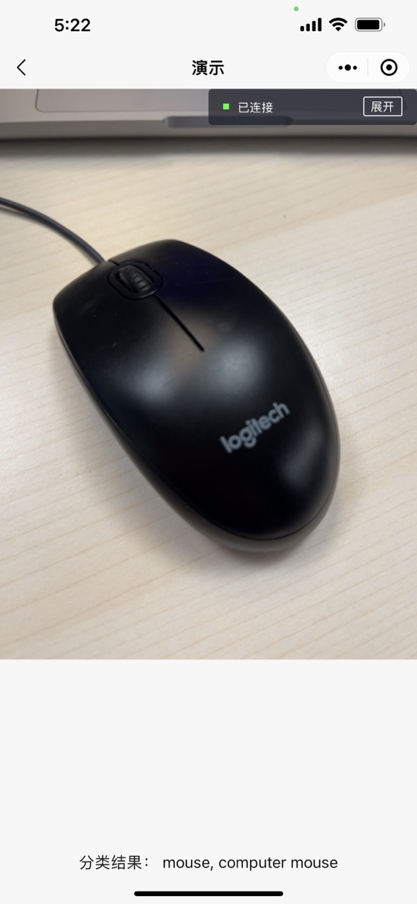

> 来源：微信开放文档（官方页面）
> 原始链接：[https://developers.weixin.qq.com/miniprogram/dev/framework/open-ability/inference/tutorial_int8.html](https://developers.weixin.qq.com/miniprogram/dev/framework/open-ability/inference/tutorial_int8.html)
> 抓取日期：2026-09-05
> 原始 HTML：`raw-html/open-ability/inference/tutorial_int8.html`

# 8bit量化使用指南

## 开始

[小程序AI通用接口](tutorial)是由官方提供的通用AI模型推理方案，支持Int8模型量化推理。可显著提升模型推理性能并减小模型的存储和计算开销。

本指南将展示如何通过该技术优化[浮点分类Demo](https://github.com/wechat-miniprogram/miniprogram-demo/tree/master/miniprogram/packageAPI/pages/ai/mobilenet)。

## 1. 准备

- 请下载[模型量化工具](https://github.com/wechat-miniprogram/xnet-miniprogram/tree/main/nncs)，并安装依赖。

```
git clone https://github.com/wechat-miniprogram/xnet-miniprogram.git && cd xnet-miniprogram/nncs && pip install -r requirements.txt
```

- 请下载 [ImageNet 数据集](https://www.image-net.org/download.php)，或者[ImageNet-mini](https://www.kaggle.com/datasets/ifigotin/imagenetmini-1000)。
- 请下载预训练模型[Mobilenetv2](https://github.com/wechat-miniprogram/xnet-miniprogram/blob/main/models/mobilenet-v2-71dot82.onnx)。目录

```
ImageNet
|---train
|     |---n01440764
|     |---n01443537
|     |---...
|     |---n15075141
|---val
|     |---n01440764
|     |---n01443537
|     |---...
|     |---n15075141
nncs
|---nncs
|---demo
|     |---imagenet_classification
|---requirements.txt
|---README.md
mobilenet-v2-71dot82.onnx
```

## 2. 量化训练示例

- 参考代码：demo/imagenet_classification/train_imagenet_onnx.py
- 修改数据来源和 ONNX 路径：

```
    ...
    args.train_data = "/data/yangkang/datasets/ImageNet"
    args.val_data = "/data/yangkang/datasets/ImageNet"
    ...
    model = "mobilenet-v2-71dot82.onnx"
```

- 运行量化训练

```
cd demo/imagenet_classification && python train_imagenet_onnx.py
```

- 日志样例：demo/imagenet_classification/nncs_onnx_lr1e-5.logfile，浮点模型精度 71.82，QAT 微调之后精度 71.52。
- 量化模型导出：mobilenetv2_qat.onnx

```
python deploy.py
```

- 量化方案支持：量化感知训练(QAT)和后训练量化(PTQ)

## 3. 小程序Demo

量化分类的 Demo 借鉴了[浮点分类Demo](https://github.com/wechat-miniprogram/miniprogram-demo/tree/master/miniprogram/packageAPI/pages/ai/mobilenet)。需注意的区别是：

```
this.session = wx.createInferenceSession({
    model: modelPath,
    precisionLevel : 0,
    allowNPU : false,    
    allowQuantize: true, // 需设置为true，激活量化推理
    });
```

## 4. 运行效果

扫描下方二维码，点击「接口 - 通用AI推理能力 - mobileNetInt8」，可以查看运行效果。


运行 demo，可以看到摄像头在采集同时，将会实时地将分类结果写回到页面下方。



完整 demo 请参考[官方 GitHub 小程序示例](https://github.com/wechat-miniprogram/miniprogram-demo/tree/master/miniprogram/packageAPI/pages/ai)

## 5. 开启耗时测试

```
  data: {
    predClass: "None",
    classifier: null,
    enableSpeedTest: true,  // 设置true
    avgTime: 110.0,
    minTime: 110.0
  },
```

iPhone 13 Pro Max，浮点分类Demo的耗时约 10ms，量化分类Demo耗时约 5ms。

