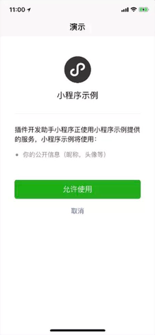
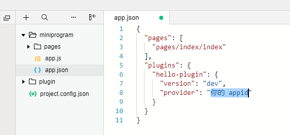

> 来源：微信开放文档（官方页面）
> 原始链接：[https://developers.weixin.qq.com/miniprogram/dev/framework/plugin/functional-pages/user-info.html](https://developers.weixin.qq.com/miniprogram/dev/framework/plugin/functional-pages/user-info.html)
> 抓取日期：2026-09-05
> 原始 HTML：`raw-html/plugin/functional-pages/user-info.html`

# 用户信息功能页

用户信息功能页用于帮助插件获取用户信息，包括 `openid` 和昵称等，相当于 [wx.login](https://developers.weixin.qq.com/miniprogram/dev/api/open-api/login/wx.login.html) 和 [wx.getUserInfo](https://developers.weixin.qq.com/miniprogram/dev/api/open-api/user-info/wx.getUserInfo.html) 的功能。

在基础库版本 [2.3.1](../../compatibility) 前，用户信息功能页是插件中唯一的获取 code 和用户信息的方式；

自基础库版本 [2.3.1](../../compatibility) 起，用户在该功能页中进行过授权后，插件可以直接调用 [wx.login](https://developers.weixin.qq.com/miniprogram/dev/api/open-api/login/wx.login.html) 和 [wx.getUserInfo](https://developers.weixin.qq.com/miniprogram/dev/api/open-api/user-info/wx.getUserInfo.html)：

- 授权是以【用户 + 小程序 + 插件】为维度进行授权的，即同一个用户在不同小程序中使用同一个插件，或同一个小程序中使用不同插件，都需要单独进行授权
- 自基础库版本 [2.6.3](../../compatibility) 起，可以使用 [wx.getSetting](https://developers.weixin.qq.com/miniprogram/dev/api/open-api/subscribe-message/wx.requestSubscribeDeviceMessage.html) 来查询用户是否授权过

另外，在满足以下任一条件时，插件可以直接调用 [wx.login](https://developers.weixin.qq.com/miniprogram/dev/api/open-api/login/wx.login.html)：

1. 使用插件的小程序与插件拥有相同的 AppID
2. 使用插件的小程序与插件绑定了同一个 [微信开放平台](https://open.weixin.qq.com) 账号，且使用插件的小程序与插件均与开放平台账号为同主体或关联主体

不满足以上条件时，[wx.login](https://developers.weixin.qq.com/miniprogram/dev/api/open-api/login/wx.login.html) 和 [wx.getUserInfo](https://developers.weixin.qq.com/miniprogram/dev/api/open-api/user-info/wx.getUserInfo.html) 将返回失败。

## 调用参数

用户信息功能页使用 [functional-page-navigator](https://developers.weixin.qq.com/miniprogram/dev/component/functional-page-navigator.html) 进行跳转时，对应的参数 name 应为固定值 `loginAndGetUserInfo`，其余参数与 [wx.getUserInfo](https://developers.weixin.qq.com/miniprogram/dev/api/open-api/user-info/wx.getUserInfo.html) 相同，具体来说：

**args 参数说明：**

| 参数名 | 类型 | 必填 | 说明 |
| --- | --- | --- | --- |
| withCredentials | Boolean | 否 | 是否带上登录态信息 |
| lang | String | 否 | 指定返回用户信息的语言，zh_CN 简体中文，zh_TW 繁体中文，en 英文。默认为 en。 |
| timeout | Number | 否 | 超时时间，单位 ms |

**注：当 withCredentials 为 true 时，返回的数据会包含 encryptedData, iv 等敏感信息。**

**bindsuccess 返回参数说明：**

| 参数 | 类型 | 说明 |
| --- | --- | --- |
| code | String | 同 [wx.login](https://developers.weixin.qq.com/miniprogram/dev/api/open-api/login/wx.login.html) 获得的用户登录凭证（有效期五分钟）。开发者需要在开发者服务器后台调用 api，使用 code 换取 openid 和 session_key 等信息 |
| errMsg | String | 调用结果 |
| userInfo | OBJECT | 用户信息对象，不包含 openid 等敏感信息 |
| rawData | String | 不包括敏感信息的原始数据字符串，用于计算签名。 |
| signature | String | 使用 sha1( rawData + sessionkey ) 得到字符串，用于校验用户信息，参考文档 [signature](../../open-ability/signature)。 |
| encryptedData | String | 包括敏感数据在内的完整用户信息的加密数据，详细见 [加密数据解密算法](../../open-ability/signature) |
| iv | String | 加密算法的初始向量，详细见 [加密数据解密算法](../../open-ability/signature) |

**userInfo 参数说明：**

| 参数 | 类型 | 说明 |
| --- | --- | --- |
| nickName | String | 用户昵称 |
| avatarUrl | String | 用户头像，最后一个数值代表正方形头像大小（有 0、46、64、96、132 数值可选，0 代表 132*132 正方形头像），用户没有头像时该项为空。若用户更换头像，原有头像 URL 将失效。 |
| gender | String | 用户的性别，值为 1 时是男性，值为 2 时是女性，值为 0 时是未知 |
| city | String | 用户所在城市 |
| province | String | 用户所在省份 |
| country | String | 用户所在国家 |
| language | String | 用户的语言，简体中文为 zh_CN |

## 示例代码

```
<!--plugin/components/hello-component.wxml-->
  <functional-page-navigator
    name="loginAndGetUserInfo"
    args="{{ args }}"
    version="develop"
    bind:success="loginSuccess"
    bind:fail="loginFail"
  >
    <button class="login">登录到插件</button>
  </functional-page-navigator>
```

```
// plugin/components/hello-component.js
Component({
  properties: {},
  data: {
    args: {
      withCredentials: true,
      lang: 'zh_CN'
    }
  },
  methods: {
    loginSuccess: function (res) {
      console.log(res.detail);
    },
    loginFail: function (res) {
      console.log(res);
    }
  }
});
```

用户点击该 `navigator` 后，将跳转到如下的用户信息功能页：



[在微信开发者工具中查看示例](https://developers.weixin.qq.com/s/Uof4Iomt731Z)：

1. 由于插件需要 AppID 才能工作，请填入一个 AppID；
2. 由于当前代码片段的限制，打开该示例后请 **手动将 AppID 填写到 `miniprogram/app.json` 中（如下图）使示例正常运行。**



