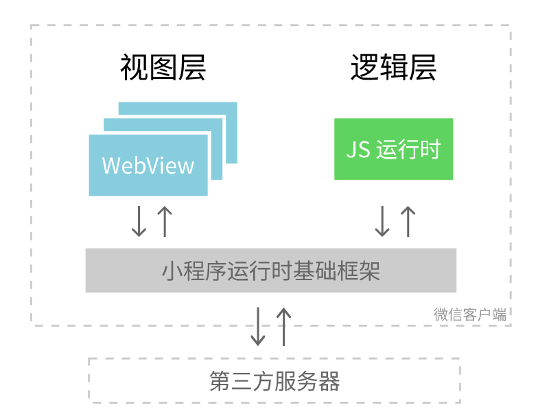

> 来源：微信开放文档（官方页面）
> 原始链接：[https://developers.weixin.qq.com/miniprogram/dev/framework/quickstart/](https://developers.weixin.qq.com/miniprogram/dev/framework/quickstart/)
> 抓取日期：2026-09-05
> 原始 HTML：`raw-html/quickstart/index.html`

# 小程序简介

小程序是一种全新的连接用户与服务的方式，它可以在微信内被便捷地获取和传播，同时具有出色的使用体验。

## 小程序技术发展史

小程序并非凭空冒出来的一个概念。当微信中的 WebView 逐渐成为移动 Web 的一个重要入口时，微信就有相关的 JS API 了。

2015年初，微信发布了一整套网页开发工具包，称之为 JS-SDK，开放了拍摄、录音、语音识别、二维码、地图、支付、分享、卡券等几十个 API。JS-SDK 解决了移动网页能力不足的问题，但并没有解决使用移动网页遇到的体验不良问题。微信面临的问题是如何设计一个比较好的系统，使得所有开发者在微信中都能获得比较好的体验。这个问题是之前的 JS-SDK 所处理不了的，需要一个全新的系统来完成，它需要使得所有的开发者都能做到：

- •快速的加载
- •更强大的能力
- •原生的体验
- •易用且安全的微信数据开放
- •高效和简单的开发

这就是小程序的由来。

## 小程序与普通网页开发的区别

小程序的主要开发语言是 JavaScript。小程序的开发与普通的网页开发有不少相似之处，对于前端开发者来说，从网页开发迁移到小程序开发的成本并不高，但是二者还是有些许区别的。

网页开发中，脚本任务和渲染任务是互斥的，这也是为什么长时间的脚本运行可能会导致页面失去响应；而在小程序中，二者是分开的，分别运行在不同的线程中，分别称为 **逻辑层** 和 **视图层** 。

小程序的视图层和逻辑层分别由多个线程管理：视图层的界面使用了 WebView 进行渲染；逻辑层采用单独的 JS 运行时来运行 JS 脚本。一个小程序存在多个界面，所以视图层存在多个 WebView 线程。

在不同的操作系统上运行的微信客户端，它所使用的 JS 引擎和 WebView 环境也有区别，以 iOS、Android 和小程序开发者工具为例，它们使用的环境如下表所示。

| **运行环境** | **逻辑层** | **视图层** |
| --- | --- | --- |
| iOS | JavaScriptCore | WKWebView |
| Android | V8 | chromium 定制内核 |
| 小程序开发者工具 | NWJS 或 Electron | Chrome WebView |

网页开发者可以使用到各种浏览器暴露出来的 DOM API，进行 DOM 选中和操作。而如上文所述，小程序的逻辑层和视图层是分开的，逻辑层运行在不同于视图层的独立 JS 运行时中，因此并不能直接使用 DOM API 和 BOM API。这一区别导致了前端开发非常熟悉的一些库，例如 jQuery、Zepto 等，在小程序中是无法运行的。同时逻辑层的 JS 运行时与 NodeJS 环境也不尽相同，所以一些 NPM 的包在小程序中也是无法运行的。

网页开发者在开发网页的时候，只需要使用到浏览器，并且搭配上一些辅助工具或者编辑器即可。小程序的开发则有所不同，需要经过申请小程序账号、安装小程序开发者工具、配置项目等等过程方可完成。

## 体验小程序

可使用微信客户端（6.7.2 及以上版本）扫码下方小程序码，体验小程序。

[查看小程序示例源码](https://github.com/wechat-miniprogram/miniprogram-demo)

